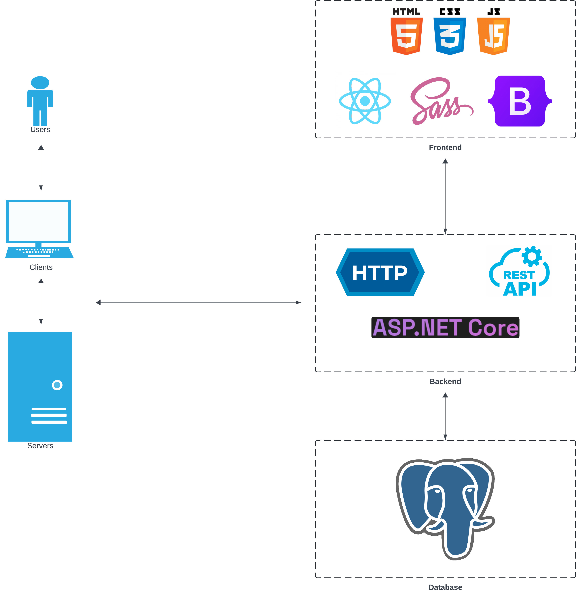

# PruneURL

⚠️ The application is still a work in progress before the stable 1.0.0 version is created. It can be considered in the "beta" phase, i.e. the application can be used end to end but there may still be bugs and improvements to be made. For more details on what is left to complete, see the [1.0.0 milestone](https://github.com/callumjgill/pruneurl/milestone/1).

An application for generating shortened URLs from longer ones.

## Setup

To run the application locally the following will need to be installed:

- [Node + npm](https://docs.npmjs.com/downloading-and-installing-node-js-and-npm)
- [git](https://git-scm.com/downloads)
- [.NET 8](https://dotnet.microsoft.com/en-us/download)
- An IDE of your choice. The repository has files for debugging the frontend using [Visual Studio Code](https://code.visualstudio.com/download), which can also be used for the backend with the [C# Dev Kit](https://marketplace.visualstudio.com/items?itemName=ms-dotnettools.csdevkit).
- [PostgreSQL](https://www.postgresql.org/download/)

⚠️ The below steps are for running developer/debuggable environments of the frontend and backend. Setup for running production builds will be provided at a later date.

To run the frontend, follow these steps:

1. Open a CLI of your choice.
2. Clone the repository to a local directory with `git clone https://github.com/callumjgill/pruneurl.git`
3. Go to the frontend directory, e.g. `cd ./<path-to-repo-directory>/frontend`
4. Install dependencies with `npm i` or `npm ci`
5. Add a `.env.local` file to the route of the `frontend` directory with the following:

   ```
   VITE_API_BASE_URL="https://localhost:7233/api"
   ```

6. Run `npm run dev`
7. You can now debug the frontend by attaching to the process or open the browser with the local route: `http://localhost:3000/`
8. To run without a backend, set the `VITE_USE_DUMMY_API` environment variable to `true` in the `.env` files. The dummy API can be configured using the following:

- `VITE_DUMMY_API_ERRORS` -> whether to return an error returned by the API
- `VITE_DUMMY_API_SUCCESS_STATUSCODE` -> the success status code returned by the API; only used if `VITE_DUMMY_API_ERRORS=false`
- `VITE_DUMMY_API_ERRORS_STATUSCODE` -> the error status code returned by the API; only used if `VITE_DUMMY_API_ERRORS=true`
- `VITE_DUMMY_API_ERRORS_MESSAGE` -> the error message returned by the API

To run the backend, follow these steps:

1. Open a CLI of your choice.
2. Clone the repository to a local directory with `git clone https://github.com/callumjgill/pruneurl.git`
3. Go to the backend directory, e.g. `cd ./<path-to-repo-directory>/backend`
4. Install Entity Framework Core tools with `dotnet tool install --global dotnet-ef`
5. With your PostgreSQL tool of choice, such as [pgAdmin](https://www.pgadmin.org/), create a new database called `pruneurl`.
6. [Create a user secrets file](https://learn.microsoft.com/en-us/aspnet/core/security/app-secrets?view=aspnetcore-8.0&tabs=linux#secret-manager) for the `PruneUrl.Backend.API` project. The contents of the file must be:
   ```
   {
     "ConnectionStrings": {
       "PostgresqlDb": "Host=localhost; Database=pruneurl; Username=<your postgresql username>; Password=<your postgresql password>; Port=<your postgresql port>"
     }
   }
   ```
7. Run the Entity Framework Core migrations with

   ```
   dotnet ef database update -s ./src/PruneUrl.Backend.API/PruneUrl.Backend.API.csproj -p ./src/PruneUrl.Backend.Infrastructure.Database/PruneUrl.Backend.Infrastructure.Database.csproj
   ```

8. Open the backend in your IDE of choice. For this setup Visual Studio Code shall be used: `code .`
9. Ensure C# Dev Kit is installed and with the "solution explorer" pane right click on the `PruneUrl.Backend` solution and build the project.
   
10. Then run the app using `Run -> Start Debugging`. When first running the app you'll be asked to choose a debug profile. Choose the profile corresponding to the http or https of the project `PruneUrl.Backend.API`.
    

## Technologies

The app is built using [Vite](https://vitejs.dev/) + [Typescript](https://www.typescriptlang.org/) + [React](https://react.dev/) for the frontend and [C#](https://dotnet.microsoft.com/en-us/languages/csharp) + [ASP.NET Core](https://dotnet.microsoft.com/en-us/learn/aspnet/what-is-aspnet-core) + [Entity Framework Core](https://learn.microsoft.com/en-us/ef/core/) + [PostgreSQL](https://www.postgresql.org/) for the backend. The code for the entire stack has been organised into a monorepo splitting each environment into their own folders.

These technologies were chosen for the following reason:

- React:
  - The application serves a single purpose, so a single page web application works well for this reason.
  - Allows creating reusable UI components.
  - JSX markup allows components to be created and maintained easily.
  - Well-defined API allows for a great developer experience, flexibilitity and makes adding interactivity easy.
  - Ton of support from both Facebook and the wider community.
- Vite:
  - Fast builds and development speed.
  - Easy to configure.
  - Easy to scale if build chunks become too large.
  - Ton of support.
- Typescript:
  - All the benefits of Javascript for website development but with strong typing
  - Predictable
  - Readable
  - Ton of support
- ASP.NET Core + C#:
  - Lightweight and highly performant.
  - Huge ecosystem.
  - Object-oriented.
  - Allows building fast HTTP APIs with minimal code and configuration.
  - Ton of support from both Microsoft and the wider community.
- Entity Framework Core
  - Lightweight and extensible
  - ORM with support for many database engines
  - Allows for easier testing with an in-memory relational database
  - Migrations creation and management is easy to use and can be used to generate SQL scripts to use during production deployments
- PostgreSQL
  - Open source
  - Robust feature set
  - No vendor lock-in
  - Popularity

## Architecture

### Full-Stack



### Frontend

The frontend is organised in such a way that different aspects of the frontend application are either grouped together or separated as appropriate. A common approach to React development has been adopted where the UI components are grouped into a `components` folder and the styling for the UI is split into its own `styles` folder. Since the [react-bootstrap](https://react-bootstrap.github.io/) component library is used, the app does not require much style definitions outside of the ones propvided by [Bootstrap](https://getbootstrap.com/). The `components` folder is for UI components which are globally shared and resued, or make sense for future resuse if needed. Components which are used to define a presentational view within the application can be found in the `views` folder. Any custom defined react hooks are found in the `hooks` folder. Any utility functions which are non-UI specific can be found in the `utils` folder. Any buisness logic which is non-UI specific can be found in the `services` folder, such as for making HTTP requests to an API. A `store` folder is for any global state management.

There is also a `features` folder which is used to group by the applications features. This folder can contain child folders which are named after a particular feature, e.g. `notifications`, and within these folders the structure can be the same as that defined above. This is similar to a Vertical Slice Architecture.

```
└── src/
    | # Omitting the files inside most folders for readability
    ├── components/
    │   ├── buttons/
    │   ├── controls/
    │   └── links/
    ├── features/
    |   └── notifications/
    |       ├── components/
    |       ├── hooks/
    |       ├── store/
    |       └── index.ts
    ├── hooks/
    |   └── useBreakpoint.ts
    ├── services/
    |   └── API/
    ├── styles/
    ├── utils/
    ├── views/
    ├── App.tsx
    └── main.tsx
```

### Backend

The backend adopts a clean architecture. This allows it to be easily testable, maintable and adaptable.

This architecture proved particularly useful during development when the database provider was changed. The original database provider chosen was Firestore but this proved to be difficult to work with, as well as a pure NoSQL datastore not being appropriate for the application. It was hard to test and many of the limitations with the SDK led to many abstraction leaks in the interface adapters. Due to these challenges, PostgreSQL was adopted with Entity Framework Core as the ORM of choice.

A slight deviation from "pure" clean architecture has been made with the use of both Entity Framework (EF) Core and [MediatR](https://github.com/jbogard/MediatR). Instead of treating the abstractions/interfaces provided by these dependencies as external (Infrastructure layer), they're used directly in the Application layer as services. MediatR is used to enable CQRS with query and command requests to separate the read-writes to the database by the application. The provided interfaces for requests and their handlers are treated as part of the application services. With EF Core, the service for accessing the underlying database, `IDbContext`, uses the abstractions provided by EF Core directly, such as `DbSet` and `EntityEntry`. By using the abstractions directly, the query and command logic can leverage many features provided by EF Core and allows for direct testing with an (in-memory) relational database.

Here is an Onion view of the architecture:

